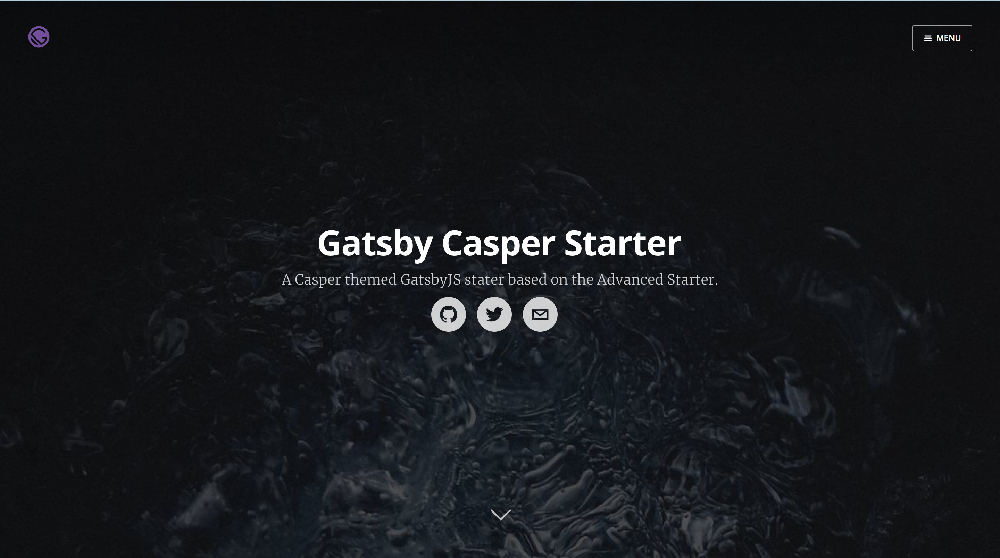

<div align="center">
    
</div>

# Gatsby Casper Starter
[](https://codeclimate.com/github/haysclark/gatsby-starter-casper)
[](https://codeclimate.com/github/haysclark/gatsby-starter-casper)
[](https://conventionalcommits.org)

A blog starter for [Gatsby](https://github.com/gatsbyjs/gatsby/), utilizing the popular [Casper (v1.4)](https://github.com/TryGhost/Casper/tree/1.4) theme authored by [Ghost.io](https://ghost.io/).  The project is based on [Gatsby Advanced Starter](https://github.com/Vagr9K/gatsby-advanced-starter) and has a lot on common with the [Gatsby Material Starter](https://github.com/Vagr9K/gatsby-material-starter), but will evolve separately. In this project the single Casper CSS file has been carefully extracted into individual components with only minor tweaks.

This starter also serves as example for the [Gatsby-Pagination](https://github.com/infinitedescent/gatsby-pagination) library.

[Demo website.](https://haysclark.github.io/gatsby-starter-casper/)



## GatsbyJS V1

This starter is based on GatsbyJS V1, which brings progressive web app features such as automatic code and data splitting (by route), prefetching, with service worker/offline-first support and PRPL pattern.

More information in the [announcement](https://www.gatsbyjs.org/blog/gatsby-first-beta-release/).

## Features

* Blazing fast loading times thanks to pre-rendered HTML and automatic chunk loading of JS files
* Separate components for everything
* High configurability:
  * Site information
  * Site social profiles
  * Copyright information
  * More!
* Author segment
  * Name
  * Location
  * Description
  * Links
  * Follow Me button
  * Social profiles
* Posts in Markdown
  * Code syntax highlighting
  * Embed YouTube videos
  * Embed Tweets
  * Pages support pagination
  * Read More linked paginated pages  
* Tags
  * Separate page for posts under each tag
  * Pages support pagination.
* Categories (pages generated but not linked in theme)
  * Separate page for posts under each category
* Disqus support (needs to be uncommented)
  * Notifications about new disqus comments
* Google Analytics support
* NPM scripts for GitHub Pages deployment
* Social features (uncomment code to use)
  * Twitter tweet button 
  * Facebook share/share count
  * Google+ share button
  * easily to add more!
* SEO
  * Sitemap generation
  * robots.txt
  * General description tags
  * Schema.org JSONLD (Google Rich Snippets)
  * OpenGraph Tags (Facebook/Google+/Pinterest)
  * Twitter Tags (Twitter Cards)
* RSS feeds
* Loading progress for slow networks
* Offline support
* Web App Manifest support
* Development tools
  * ESLint for linting
  * Prettier for code style
  * Remark-Lint for linting Markdown
  * write-good for linting English prose
  * gh-pages for deploying to GitHub pages
  * CodeClimate configuration file and badge

NOTE: Feel free to check out [Gatsby Material Starter](https://github.com/Vagr9K/gatsby-material-starter) if you are interested in a more opinionated starter with Material Design in mind.

## Getting Started

Install this starter (assuming [Gatsby](https://github.com/gatsbyjs/gatsby/) is installed) by running from your CLI:

```sh
gatsby new YourProjectName https://github.com/haysclark/gatsby-starter-casper
npm install # or yarn install
npm run develop # or gatsby develop
```

Or you can fork the project, make your changes there and merge new features when needed.

Alternatively:

```sh
git clone https://github.com/haysclark/gatsby-starter-casper YourProjectName # Clone the project
cd YourProjectname
rm -rf .git # So you can have your own changes stored in VCS.
npm install # or yarn install
npm run develop # or gatsby develop
```

## Configuration

 Edit the export object in `data/SiteConfig`:

 ```js
 module.exports = {
     blogPostDir: "sample-posts", // The name of directory that contains your posts.
     blogAuthorDir: "sample-authors", // The name of directory that contains your authors.
     blogAuthorId: "casper", // The default and fallback author ID used for blog posts without a defined author.
     siteTitle: "Gatsby Casper Starter", // Site title.
     siteTitleAlt: "GatsbyJS Casper Theme Starter", // Alternative site title for SEO.
     siteLogo: "/logos/logo-1024.png", // Logo used for SEO and manifest.
     siteUrl: "https://haysclark.github.io", // Domain of your website without pathPrefix.
     pathPrefix: "/gatsby-starter-casper", // Prefixes all links. For cases when deployed to example.github.io/gatsby-starter-casper/.
     siteDescription: "A Casper themed GatsbyJS stater based on the Advanced Starter.", // Website description used for RSS feeds/meta description tag.
     siteCover: "/images/blog-cover.jpg", // Optional, the cover image used in header for home page.
     siteNavigation: true, // If navigation is enabled the Menu button will be visible
     siteRss: "/rss.xml", // Path to the RSS file.
     siteRssAuthor: "Casper User", // The author name used in the RSS file
     // siteFBAppID: "1825356251115265", // optional, sets the FB Application ID for using app insights
     sitePaginationLimit: 10, // The max number of posts per page.
     googleAnalyticsID: "UA-111982167-1", // GA tracking ID.
     siteSocialUrls: [
       "https://github.com/haysclark/gatsby-starter-casper",
       "https://twitter.com/gatsbyjs",
       "mailto:gatsbyjs@example.com"
     ],
     postDefaultCategoryID: "Tech", // Default category for posts.
     // Links to social profiles/projects you want to display in the navigation bar.
     userLinks: [
       {
         label: "GitHub",
         url: "https://github.com/haysclark/gatsby-starter-casper",
         iconClassName: "fa fa-github" // Disabled, see Navigation.jsx
       },
       {
         label: "Twitter",
         url: "https://twitter.com/gatsbyjs",
         iconClassName: "fa fa-twitter" // Disabled, see Navigation.jsx
       },
       {
         label: "Email",
         url: "mailto:gatsbyjs@example.com",
         iconClassName: "fa fa-envelope" // Disabled, see Navigation.jsx
       }
     ],
     // Copyright string for the footer of the website and RSS feed.
     copyright: {
       label: "Gatsby Casper Starter" // Label used before the year
       // year: "2018" // optional, set specific copyright year or range of years, defaults to current year
       // url: "https://www.gatsbyjs.org/" // optional, set link address of copyright, defaults to site root
     },
     themeColor: "#c62828", // Used for setting manifest and progress theme colors.
     backgroundColor: "#e0e0e0", // Used for setting manifest background color.
     promoteGatsby: true // Enables the GatsbyJS promotion information in footer.
   };
 ```

 You can also optionally set `pathPrefix`:
 ```js
 module.exports = {
  // Note: it must *not* have a trailing slash.
       pathPrefix: '/gatsby-starter-casper', // Prefixes all links. For cases when deployed to example.github.io/gatsby-starter-casper/.
}

 ```

 WARNING: Make sure to edit `static/robots.txt` to include your domain for the sitemap!

## Content

### Posts

Posts are authored using Markdown and include some optional YAML frontmatter data properties.  Each post should have a separate folder for the .md file in addition to any images or other media related to that post.  Posts are stored in a subfolder in the ```/content/``` directory; the target subfolder is set by the _blogPostDir_ property in _SiteConfig.js_.

### Authors

Each post can reference the author of the post, if the author is not set the default author will be used; which is controlled by the _blogAuthorId_ property in _SiteConfig.js_.  All authors, including the default author (aka _blodAuthorId_) must have an author JSON file.  These JSON files MUST be stored in a folder names ```authors```, for Gatsby to parse them correctly.  The location of this ```authors``` folder can be controlled by the _blogAuthorDir_ property in _SiteConfig.js_. It IS possible to have the ```authors``` folder inside the  _blogPostDir_ folder.

## Contributing

👍🎉 First off, thanks for taking the time to contribute! 🎉👍

The project uses [Conventional Commits](https://conventionalcommits.org/) which are simple and easy to follow. In general, use your best judgment, and feel free to propose changes by creating an issue and then mention the issue in your pull request.

## License

MIT